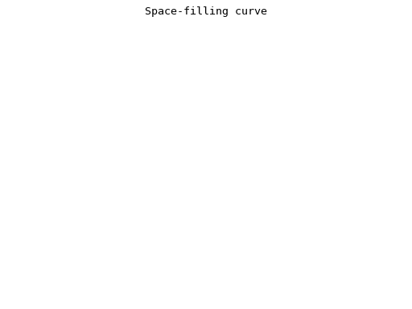

## Space-filling curve

Italian mathematician Giuseppe Peano showed in 1890 that it is
possible to construct a surjective continuous curve mapping the
unit interval onto the unit square. Here we extend the idea by
constructing a trajectory (x(t), y(t), z(t)) in 3-space which 
fills the unit cube.

